# SlimNet — What You Learned: A Complete Walkthrough

**Project**: Efficient Architecture Design + Distillation + Structured Pruning for Edge Deployment
**Goal of this document**: Explain every file you wrote, every concept it exercises, the data flowing in and out of each stage, and how the decisions you made map onto real problems edge AI engineers solve — including what they do when things break in the specific ways yours did.

---

## Table of Contents

1. [The Big Picture: Why This Pipeline Exists](#1-the-big-picture)
2. [Stage-by-Stage File Reference](#2-stage-by-stage-file-reference)
3. [Core Concepts Explained](#3-core-concepts-explained)
4. [Your Actual Results, Interpreted](#4-your-actual-results-interpreted)
5. [Problems You Hit and How Real Engineers Handle Them](#5-problems-you-hit-and-how-real-engineers-handle-them)
6. [What to Take Away](#6-what-to-take-away)

---

## 1. The Big Picture

Most people learning "edge AI" start by taking an existing model and shrinking it — quantizing, pruning, converting formats. That teaches you compression, but it doesn't teach you **why efficient architectures look the way they do**, or **how to build capability into a small model rather than just deleting it from a big one afterward**.

SlimNet forces you through three distinct skills, stacked in a specific order, each producing an artifact the next stage depends on:

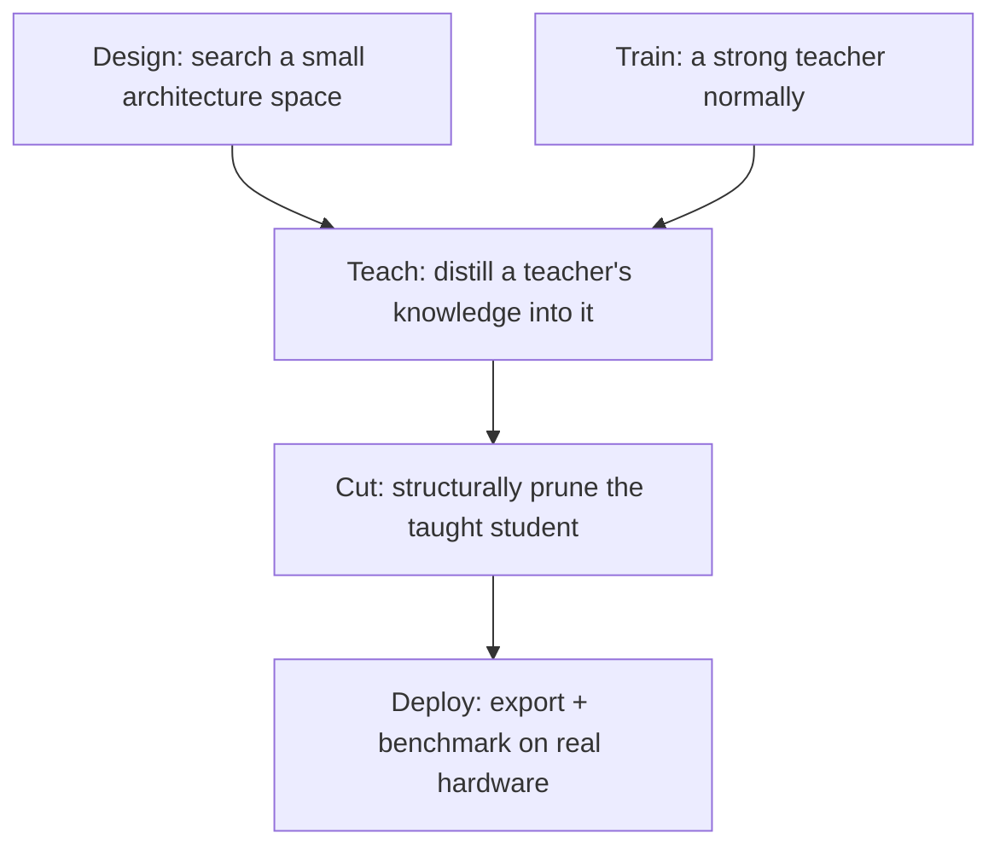

Each arrow is a **causal dependency**, not just a sequence — the student architecture used in distillation must be the one search found; pruning must start from the distilled weights, not raw random-init weights, because pruning removes structure from something that already knows the task well; export/benchmark need a final, fixed graph shape which only exists after pruning is done.

---

## 2. Stage-by-Stage File Reference

For each file: **what it does, what goes in, what comes out, and why it exists at all.**

### 2.1 `data.py`

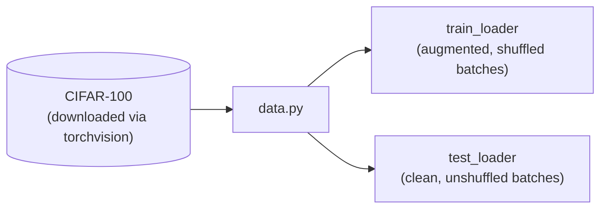

**What it does**: Wraps `torchvision.datasets.CIFAR100` with the correct normalization constants (CIFAR-100's real per-channel mean/std, not ImageNet's — a common silent bug that costs a few accuracy points if copied wrong) and standard augmentation (random crop + flip) for training only.

**Why it exists as its own file**: Every other training script (teacher, search, distillation, control, pruning finetune, sweep) needs identical data loading. Centralizing it means the augmentation pipeline is guaranteed identical across every experiment — if training and control used different augmentation, you couldn't trust the comparison between them.

**Concept**: data augmentation isn't just "more data" — random crop/flip specifically teaches spatial and mirror invariance the model wouldn't otherwise generalize, and doing it identically everywhere is what makes your controlled comparisons valid.

---

### 2.2 `search_space.py`

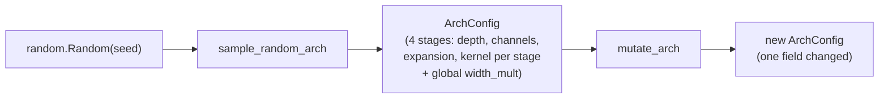

**What it does**: Defines the discrete space of possible student architectures, all built from MobileNetV2-style inverted-residual blocks. `sample_random_arch` produces a random point in that space; `mutate_arch` produces a small perturbation of an existing one.

**Why it exists**: This is the injected prior that makes your search tractable. You're not asking "what architecture family is good" (real NAS asks that) — you're asking "given this family, what depth/width/kernel combination is good," which shrinks the space from effectively infinite to ~10^9 structured points.

**No file I/O here** — this module produces Python objects (`ArchConfig` dataclasses) consumed directly by other modules in the same process, or serialized to JSON only when the search finishes (`student_searched_arch.json`).

---

### 2.3 `student_model.py`

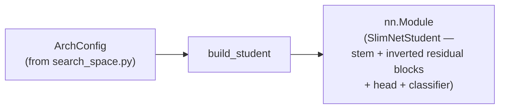

**What it does**: Turns an abstract `ArchConfig` into an actual, runnable PyTorch model — real `Conv2d`/`BatchNorm2d`/`ReLU6` layers wired into inverted residual blocks (expand → depthwise → project, linear bottleneck, conditional residual).

**Why it exists separately from `search_space.py`**: Separating the *description* of an architecture (a small dataclass) from its *instantiation* (an actual module with weights) lets you serialize/log/compare architectures cheaply (as JSON) without needing to build the full model every time you just want to inspect a config.

**Concept**: this file is a physical embodiment of "why MobileNet looks the way it does" — every design choice here (depthwise separable convs, linear bottleneck, `_make_divisible` channel rounding) has a specific FLOP or hardware-tiling justification, not aesthetic preference.

---

### 2.4 `teacher_model.py`

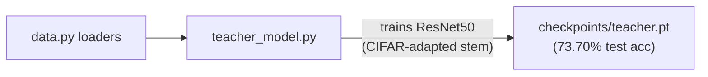

**What it does**: Builds a ResNet50 adapted for CIFAR's 32×32 input (the original 7×7/stride-2 stem + maxpool would destroy a 32×32 image almost immediately — replaced with a 3×3/stride-1 conv and no maxpool) and trains it normally with standard cross-entropy, SGD, cosine LR schedule.

**Input**: CIFAR-100 training data. **Output**: `teacher.pt`, a checkpoint containing the best-accuracy weights seen across 60 epochs.

**Your actual result**: 73.70% test accuracy, smooth monotonic convergence — a healthy, standard supervised training run with no red flags.

**Why it's independent of everything else**: The teacher doesn't know or care what the student architecture will be. It's just "the best accuracy you can get on this task with a normal-sized model," which becomes the ceiling the rest of the pipeline works against.

---

### 2.5 `evolutionary_search.py`

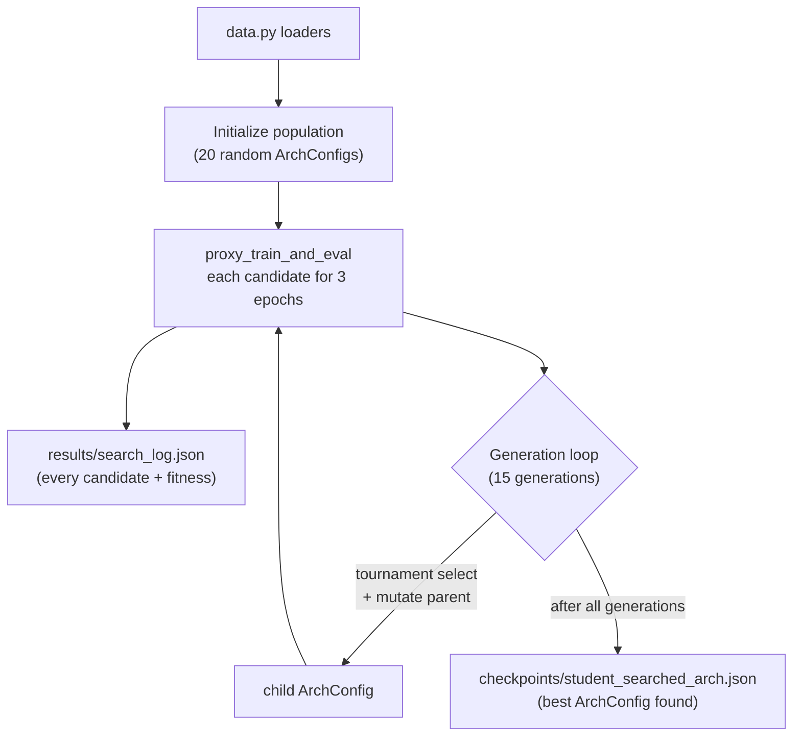

**What it does**: Regularized evolutionary search (Real et al. 2019 style). Maintains a population of 20 architectures; each generation picks a tournament subset, mutates the tournament's best member, cheaply trains+evaluates the child (3 proxy epochs, not full convergence), and replaces the oldest population member.

**Input**: the search space definition + CIFAR-100 loaders. **Output**: `search_log.json` (a full history of every candidate evaluated — 35 total: 20 init + 15 generations) and `student_searched_arch.json` (just the single winning architecture's config, ready for the next stage to load).

**Your actual result**: init population's best was 43.43% proxy accuracy; the search found 45.07% by generation 4 and did not beat it again through generation 14 — a real, if modest, +1.64 point improvement, with visible noise (one candidate crashed to 27.87% due to an unlucky mutation).

**Why proxy training instead of full training per candidate**: 35 candidates × full 100-epoch training would take roughly the same wall-clock time as your entire remaining pipeline, repeated 35 times. 3-epoch proxies are ~30x cheaper per candidate and reliably enough for *ranking*, even though they don't predict final converged accuracy. This is the single biggest reason this NAS is "toy" — see Section 3.4.

---

### 2.6 `distillation.py`

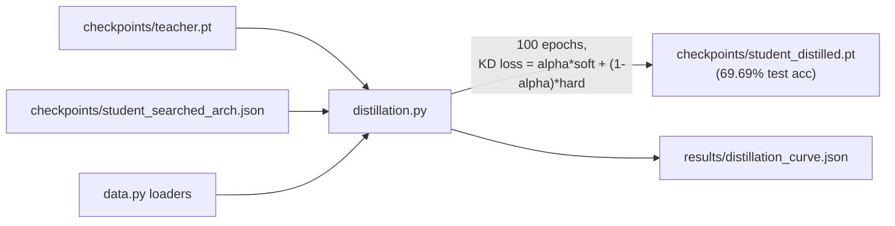

**What it does**: Loads the frozen teacher and the searched student architecture, trains the student using Hinton et al.'s distillation loss — a weighted sum of (a) standard hard-label cross-entropy and (b) KL-divergence between temperature-softened teacher and student output distributions.

**Input**: teacher checkpoint (frozen, eval mode, no gradients) + searched architecture config + CIFAR-100 loaders. **Output**: `student_distilled.pt` (best checkpoint by test accuracy) + a per-epoch training curve log.

**Your actual result**: 69.69% final accuracy, smooth convergence, no instability — within ~4 points of the 73.70%-accuracy teacher despite the student having roughly 1/74th the parameters.

**Why temperature and alpha specifically**: Temperature > 1 makes a confident teacher's secondary (wrong-answer) probabilities numerically visible to the loss function — without it, a 99.9%-confident teacher's "dark knowledge" is compressed into a range too small to provide useful gradient signal. Alpha weights how much the student trusts the teacher's soft distribution vs. the ground-truth hard label.

---

### 2.7 `train_control_no_distill.py`

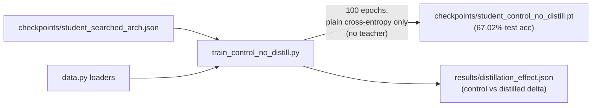

**What it does**: Trains the exact same architecture, same optimizer, same LR schedule, same epoch budget as `distillation.py` — the *only* difference is the loss function (plain cross-entropy, no teacher involved at all).

**Why this file needs to exist at all**: Without it, "the distilled student got 69.69%" is a number with no reference point — you can't tell if distillation helped, hurt, or did nothing. This is a controlled experiment in the scientific sense: isolate exactly one variable (loss function) and hold everything else fixed.

**Your actual result**: 67.02% control vs. 69.69% distilled — **+2.67 points, +4.0% relative, attributable specifically to distillation.**

---

### 2.8 `sweep_distillation_hparams.py`

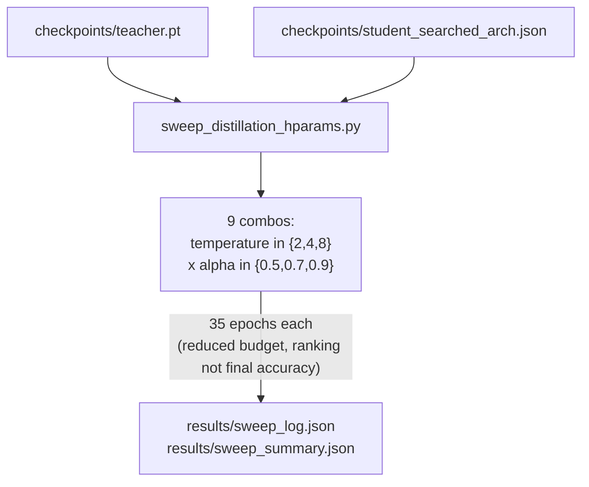

**What it does**: Grid search over the two most important KD hyperparameters, at a reduced epoch budget (35 instead of 100) per combination — same "cheap proxy for ranking, not final accuracy" logic as the architecture search, applied to hyperparameters instead.

**Why it exists**: Your original (T=4.0, alpha=0.7) was a reasonable default, not a tuned choice. This answers "was that default actually good, or would something else clearly beat it" — without running 9 full 100-epoch trainings (900 epochs, computationally prohibitive).

**Time cost**: ~11 hours at your observed training pace (9 × 35 × ~2.1 min/epoch) — the most expensive single script in the whole project, which is why it's explicitly optional/secondary given your learning-focused goal.

---

### 2.9 `pruning.py`

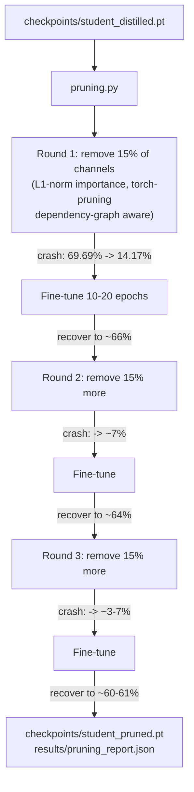

**What it does**: Structured (whole-channel, not individual-weight) pruning using `torch-pruning`'s dependency-graph tracing. Each round: rank every prunable channel by L1-norm of its weights, physically remove the lowest 15%, then fine-tune to recover accuracy. Repeated 3 times (gradual pruning) rather than one 45% cut.

**Input**: the distilled checkpoint. **Output**: `student_pruned.pt` (final smaller model) + a full report of params/FLOPs/accuracy at every round, both pre- and post-fine-tune.

**Your actual results** (10-epoch fine-tune version):

| Stage | Params | FLOPs | Accuracy |
|---|---|---|---|
| Before pruning | 0.32M | 22.17M | 69.69% |
| After round 1 | 0.25M | 16.35M | 66.59% |
| After round 2 | 0.20M | 12.07M | 63.31% |
| After round 3 (final) | 0.16M | 8.89M | 60.31% |

With 20-epoch fine-tuning instead of 10: final accuracy was 61.01% — only **+0.70 points** from doubling the recovery budget, showing the ~9-point total accuracy cost is largely intrinsic to this pruning ratio, not a training-budget artifact.

**Why structured, not unstructured, pruning**: unstructured pruning zeroes individual weights, leaving the tensor the same physical size unless you have specialized sparse-matrix hardware/kernels — on a Jetson running standard TensorRT, that gives you *no* real speedup. Structured pruning physically shrinks tensor shapes, which is what your params (0.32M→0.16M, literally half) and FLOPs (22.17M→8.89M, 40% remaining) numbers show — real, physically smaller compute.

---

### 2.10 `export_onnx.py`

**What it does**: Converts the final pruned PyTorch model into ONNX (a portable, static graph format), validates the graph is well-formed, then simplifies it (constant-folds, removes redundant nodes left over by the exporter).

**Why ONNX as a middle step, not straight to TensorRT**: ONNX is what freezes the dynamic PyTorch graph into a static one TensorRT (or any other inference engine) knows how to parse. It's also portable — the same `.onnx` file could target TensorRT, ONNX Runtime, or other backends without retraining.

---

### 2.11 `benchmark_jetson.py`

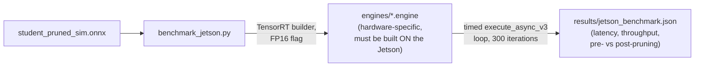

**What it does**: Builds an FP16 TensorRT engine from the ONNX graph (must run on the actual Jetson — TensorRT engines are hardware-specific and cannot be built on your GTX and copied over), then times 300 inference iterations to get mean/p99 latency and throughput, comparing the unpruned-distilled model against the final pruned model.

**Why this is the last stage**: It's the only stage that answers the actual "edge AI" question the rest of the pipeline was building toward — does any of this translate into real speedup on real constrained hardware? FLOPs/params reductions are a proxy; measured latency on the Jetson is the ground truth.

---

## 3. Core Concepts Explained

### 3.1 Depthwise Separable Convolutions — the foundational trick

A standard convolution costs `H×W×C_in×C_out×k²` FLOPs. Splitting it into a depthwise conv (per-channel, no mixing: `H×W×C_in×k²`) plus a pointwise 1×1 conv (channel mixing: `H×W×C_in×C_out`) cuts total FLOPs by roughly `1/C_out + 1/k²` — about **8-9x fewer FLOPs** for typical `k=3, C_out=64`. This is *why* MobileNet-family models exist; without this trick, small-but-accurate CNNs on edge hardware wouldn't be practical at all.

### 3.2 Inverted Residuals + Linear Bottlenecks

MobileNetV2's refinement: expand channels first (more room for the depthwise step to extract features), then depthwise conv, then project back down — and critically, **no activation function on the final projection**, because ReLU zeroes negative values, which destroys information disproportionately in low-dimensional (compressed) spaces. Your `InvertedResidualBlock` implements exactly this: `ReLU6` after expand and depthwise, nothing after the final projection conv+BN.

### 3.3 Knowledge Distillation

The core idea (Hinton et al. 2015): a trained teacher's *wrong-answer* probabilities carry real information about class similarity ("dark knowledge") that one-hot hard labels can never convey. Temperature scaling makes that information numerically visible; the KL-divergence loss term transfers it to the student. Your control experiment (Section 2.7) is what proved this actually happened in your specific run — a +2.67 point, isolated, attributable gain.

### 3.4 Why Your NAS Is "Toy" — Four Specific, Separate Reasons

| Axis | Real NAS (e.g. Zoph & Le 2017, EfficientNet search) | Your search |
|---|---|---|
| **Search space size/freedom** | Arbitrary DAG topology, many op types, no assumed block structure — can discover architectures unlike any hand-designed family | Fixed MobileNet-style block type and stage structure; only depth/width/kernel/expansion searched — ~10^9 points, but all "MobileNet-shaped" |
| **Per-candidate evaluation cost** | Train each candidate near full convergence (hundreds of epochs) — original NAS paper used ~22,400 GPU-days | 3-epoch proxy training — orders of magnitude cheaper, but noisier, unreliable ranking signal (your gen-9 candidate crashing to 27.87% illustrates this) |
| **Number of candidates evaluated** | Real evolutionary NAS (Real et al. 2019): population ~1000, tens of thousands total evaluated | 35 total (20 init + 15 generations) — a quick local improvement search, not a statistically robust exploration |
| **Search sophistication** | Often includes learning-curve extrapolation, weight-sharing supernets (ENAS/DARTS), or latency predictors trained on real hardware | None of these — simplest possible skeleton: sample, mutate, cheaply retrain from scratch, compare fitness |

**One-sentence honest summary**: this is regularized evolutionary search with a hand-constrained ~10^9-architecture MobileNet-family space and noisy 3-epoch proxy fitness over only 35 total candidates — real NAS differs by orders of magnitude in candidates evaluated, training-per-candidate cost (or avoiding that cost via weight-sharing), space freedom, and often optimizes against measured hardware latency instead of FLOP proxies.

### 3.5 Structured vs. Unstructured Pruning

Unstructured pruning zeroes individual weights based on some importance criterion, producing a sparse matrix that's the **same physical size in memory** unless you have specialized sparse-matrix inference kernels (most edge inference stacks, including standard TensorRT, don't exploit this well). Structured pruning removes entire channels/filters, which shrinks the actual tensor shapes flowing through the network — this is why your params and FLOPs numbers dropped for real, and why it's the only kind of pruning that reliably translates into measured latency improvement on a Jetson.

### 3.6 L1-Norm Channel Importance — a heuristic, not a guarantee

The assumption (Li et al. 2017): a filter with small-magnitude weights produces low-magnitude outputs on average, so it probably contributes less. This is *not* provably correct — a filter could have small weights but fire critically on a rare input pattern. This is exactly why your pipeline never does one-shot pruning followed by no recovery: the immediate post-prune accuracy crashes you observed (69.69%→14.17%, then worse each round) are the heuristic being wrong in aggregate for some fraction of removed channels, and fine-tuning is what corrects for that.

---

## 4. Your Actual Results, Interpreted

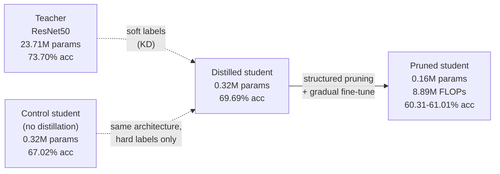

**The full chain of numbers, and what each comparison isolates:**

- **Teacher vs. control student**: 73.70% vs 67.02% — the raw capacity gap between a 23.71M-param model and a 0.32M-param model on this task (~6.68 points, ~74x fewer params).
- **Control vs. distilled student**: 67.02% vs 69.69% — the isolated effect of distillation alone, same architecture, same budget (+2.67 points). Distillation recovered about 38% of the capacity gap between student and teacher.
- **Distilled vs. pruned student**: 69.69% vs ~60-61% — the cost of removing 60% of parameters and 60% of FLOPs via structured pruning, largely intrinsic to the method at this ratio (confirmed by the epoch-budget sensitivity check, not a training-budget artifact).

---

## 5. Problems You Hit and How Real Engineers Handle Them

### Problem A: "My proxy/short-training signal is noisy — one candidate did much worse than its parent."
**What happened to you**: generation 9's mutation crashed to 27.87% fitness against a population averaging ~35-45%.
**What real engineers do**: this is expected and handled structurally, not by chasing individual bad outliers. Regularized evolution's age-based replacement (oldest member replaced regardless of fitness) is specifically designed to be robust to this — a single bad mutation doesn't derail the population, it just gets discarded next generation. If noise dominates the *whole* search (not just one candidate), the standard fixes are: increase proxy epoch count, evaluate each candidate on multiple seeds and average, or switch to a less noisy proxy signal (e.g., a small held-out validation subset with early-stopping-based estimate). Real production NAS teams often maintain a "noise budget" — they know roughly how much proxy variance to expect and size populations/generations to be robust to it, rather than trying to eliminate noise entirely.

### Problem B: "My model crashes to near-random accuracy immediately after pruning."
**What happened to you**: every pruning round crashed accuracy to 3-14% before fine-tuning.
**What real engineers do**: this is universally expected with any one-shot structural change of meaningful size, and the standard response is exactly what you did — gradual pruning with fine-tuning between rounds, rather than pruning to the final target in one step. If the crash is *unusually* severe (near-total accuracy collapse that doesn't recover even after generous fine-tuning), that's a signal to check: (a) is the pruning ratio per round too aggressive for this architecture, (b) is an importance metric other than L1-norm more appropriate (e.g., some engineers use gradient-based or Taylor-expansion importance scores, which better estimate a channel's actual contribution to the loss, at higher compute cost per pruning decision), or (c) does the architecture have unusually low redundancy to begin with (already-efficient models like MobileNet are known to be harder to prune further than over-parameterized models like plain ResNets, precisely because they don't have as much slack).

### Problem C: "Does more fine-tuning actually help, or is my accuracy loss fundamental?"
**What happened to you**: you tested this directly — 10 vs. 20 epoch fine-tuning budgets, found only +0.70 points difference.
**What real engineers do**: exactly this ablation, as a standard diagnostic before concluding anything about a compression method's fundamental cost. If more fine-tuning helps a lot, the original budget was under-provisioned — cheap fix, no real conclusion about the method itself. If it helps little (your case), engineers treat the accuracy cost as closer to a real property of the compression ratio/method and look elsewhere for improvement: a gentler pruning ratio per round, a better importance metric, or accepting the tradeoff as the cost of the size target. This is precisely the "isolate one variable, observe, conclude" discipline that separates a debugged pipeline from a blind one.

### Problem D: "A config value silently became a string instead of a float, crashing deep inside an optimizer."
**What happened to you**: `weight_decay: 5e-4` in YAML parsed as the string `"5e-4"` rather than a float, because PyYAML's default resolver doesn't reliably recognize scientific notation without a decimal point.
**What real engineers do**: this exact class of bug (config value has the right *appearance* but wrong *type*) is common enough that production ML codebases typically add a config validation/schema layer (e.g. Pydantic models, or explicit `float(...)`/`int(...)` casts at the point every config value is consumed) specifically to catch type mismatches at load time with a clear error message, rather than letting them surface as a cryptic `TypeError` three function calls deep inside a third-party library. The fix isn't "remember to format YAML correctly" — it's "never trust a config value's type without checking/casting it," because YAML, JSON, and CLI argument parsing all have their own subtle type-coercion quirks that will eventually bite you again in a different form.

### Problem E: "Engine built on my dev GPU won't run on the target device."
**Where this applies going forward**: your `benchmark_jetson.py` step, once you actually run it.
**What real engineers do**: TensorRT engines are compiled for the exact GPU architecture (and TensorRT/CUDA version) they were built on — this is a hard constraint, not a portability inconvenience. Standard practice is either (a) build engines directly on the target device (what your pipeline does — simplest, always correct, but requires the target device to have a full build toolchain), or (b) use TensorRT's cross-compilation support for known target architectures when building directly on-device isn't practical at scale (e.g., building engines for a fleet of identical Jetson units from a CI server), which requires specifying the exact target compute capability at build time. For a single-device learning project, on-device build is the right call and what you're already set up to do.

---

## 6. What to Take Away

If someone asked you "what did you actually learn from SlimNet," here's the version that shows real understanding rather than just having run scripts:

1. **Efficient architectures aren't arbitrary** — depthwise separable convolutions, inverted residuals, and linear bottlenecks each solve a specific FLOP or information-preservation problem, and you can point to the exact mechanism for each.
2. **A small, constrained search space plus cheap proxy evaluation is a real, useful technique — with a real, known limitation (noisy ranking) — and you watched that limitation happen live** (the generation-9 crash), rather than just reading about it.
3. **Distillation's benefit is measurable, not assumed** — you built the control that proves it, and got a specific, defensible number (+2.67 points) instead of an unfalsifiable claim.
4. **Structured pruning's accuracy cost can be diagnosed as fundamental vs. budget-limited** — you ran the exact ablation (10 vs 20 epoch fine-tuning) that tells the difference, and got a clear answer (mostly fundamental, at this ratio).
5. **Every one of these stages has a "real vs. toy" scale**, and you can now explain precisely where SlimNet sits on that scale for each — which is the actual skill that transfers to whatever edge AI problem you tackle next, at whatever compute budget you have available.